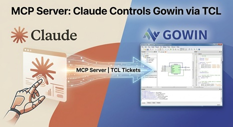

Gowin MCP Server using FastMCP. This allow Claude to interact with the Gowin toolchain programmatically and work with Gowin FPGAs

# Key Features

1. **Process Management**: The `GowinProcess` class manages the subprocess state, output buffering, and prompt detection - all the core functionality from the GUI version.

2. **MCP Tools Exposed**:
   - `start_gowin()` - Start the Gowin shell process
   - `stop_gowin()` - Stop the process gracefully
   - `create_project()` - Create a new project
   - `add_file()` - Add files to the project
   - `set_top_module()` - Set the top module
   - `set_output_base_name()` - Set output base name
   - `set_option()` - Set generic options
   - `run_synthesis()` - Run synthesis
   - `run_place_and_route()` - Run P&R
   - `run_all()` - Run complete flow
   - `send_tcl_command()` - Send custom TCL commands
   - `get_process_status()` - Check process status

3. **Thread-Safe Output Handling**: The output reader runs in a background thread and buffers output safely using locks.

4. **Command Synchronization**: Commands wait for the TCL prompt (`% `) by default, with configurable timeouts.

# Usage

1. **Install FastMCP**:
   ```bash
   pip install fastmcp
   ```

2. **Configure in Claude Desktop** (add to config):
   ```json
   {
     "mcpServers": {
       "gowin": {
         "command": "python",
         "args": ["path/to/gowin_mcp_server.py"]
       }
     }
   }
   ```

Now Claude can interact with your Gowin toolchain programmatically through these MCP tools!